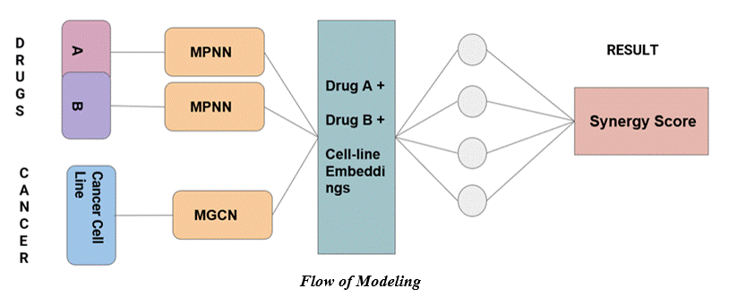

# Cancer Drug Synergy Prediction using GNN and GCNN

---------------------------------

### Abstract: 
While computational methods are emerging progressively, our paper focuses on implementing deep learning techniques to compute a viable score for a combination of drug effects on cancer cells. Drug combination therapies are an ingrained concept in cancer treatment. Hence, identifying the novel synergistic combinations is what we are focusing on here. Our models use the chemical structure of drugs and genomic information of various cancer cell lines as input information, a normalization strategy to justify the input data heterogeneity, and tapered layers to model drug synergies.

### Data Source

### Model Description:

